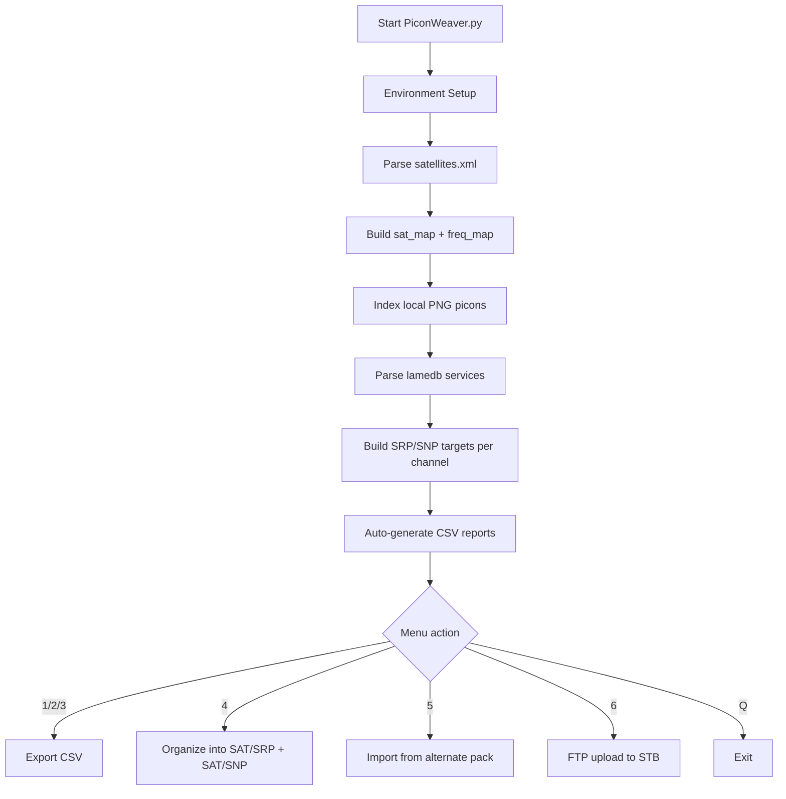

# 🎛️ PiconWeaver — Enigma2 Picon Automation Suite

<div align="center">


**A high-visibility, colorized, menu-driven utility for mapping Enigma2 services to picons, repairing missing icons, organizing satellite folders, and deploying to STB over FTP.**

</div>

---

## 📌 What this script does

`PiconWeaver.py` reads your Enigma2 source files (`lamedb` + `satellites.xml`) and your picon image folder, then builds a complete service map.

From that map, it can:

1. Export full service inventory to CSV.
2. Export channels that already have picons.
3. Export channels missing picons.
4. Rebuild organized picon folders by orbital position (`<SAT>/SRP`, `<SAT>/SNP`).
5. Heal missing picons from an alternate icon pack.
6. Upload selected picons to your set-top box (STB) via FTP (with remote cleanup).

---

## 🧠 Script architecture (how it works internally)



### Data objects used

- **`sat_map`**: Namespace → satellite metadata (`name`, `pos`, `pos_val`).
- **`freq_map`**: `(frequency, symbol_rate)` → satellite metadata fallback lookup.
- **`picon_index`**: lowercase filename → real local png filename.
- **`services`**: parsed service rows with both SRP and SNP target names.

---

## 🗂️ Required inputs and expected layout

At minimum, keep these in the same folder as `PiconWeaver.py` (or provide custom paths at runtime):

```text
.
├── PiconWeaver.py
├── lamedb
├── satellites.xml
└── picons/
    ├── somechannel.png
    ├── 1_0_1_....png
    └── ...
```

### Required files

- `lamedb` — service/transponder list from Enigma2.
- `satellites.xml` — orbital metadata + transponders.
- `picons/` — your source png library (flat or mixed naming is fine).

---

## 🚀 Quick start (detailed)

## 1) Run the script

```bash
python3 PiconWeaver.py
```

You will be prompted for:

- Path to `lamedb` (default: `lamedb`)
- Path to `satellites.xml` (default: `satellites.xml`)
- Path to picons folder (default: `picons`)

Press **Enter** to accept defaults.

## 2) Initial indexing phase

After setup, the script automatically:

- Parses satellite orbital data.
- Indexes existing local picon PNGs.
- Parses all services from `lamedb`.
- Generates fresh CSV reports:
  - `all_services.csv`
  - `found_picons.csv`
  - `missing_picons.csv`

## 3) Use menu actions

Main menu options:

- **[1] Export ALL Services**
- **[2] Export FOUND Picons**
- **[3] Export MISSING Picons**
- **[4] Organize Picon Dirs**
- **[5] Heal Missing Picons**
- **[6] FTP Upload to STB**
- **[Q] Quit**

---

## 🧾 Output files and meaning

### CSV report columns

Every export contains this schema:

- `Channel Name`
- `SRP Filename`
- `SNP Filename`
- `Position`
- `Satellite`
- `Status` (`Found` or `Missing`)

### Organized folder output (Option 4)

Option 4 builds/rebuilds this structure for each active orbital position:

```text
picons/
├── 13.0E/
│   ├── SRP/
│   │   ├── 1_0_1_....png
│   │   └── ...
│   └── SNP/
│       ├── channelname.png
│       └── ...
├── 19.2E/
│   ├── SRP/
│   └── SNP/
└── ...
```

> ⚠️ Important: Option 4 **purges existing `<SAT>/SRP` and `<SAT>/SNP` directories** before rebuilding them.

---

## 🩹 Healing missing picons (Option 5)

When you choose Option 5, the script asks for an alternate folder path.

It then:

1. Scans that folder for `.png` files.
2. Matches missing channels by either SRP filename or SNP filename.
3. Copies matched files into your primary `picons` source folder.
4. Regenerates all CSV reports.

This is ideal for merging external picon packs without manual matching.

---

## 📤 FTP deployment to STB (Option 6)

Option 6 is a deployment pipeline with safety caveats:

1. Prompt for STB connection details (IP/user/password).
2. Prompt for remote path (default `/media/hdd/picon`).
3. Choose mode: `SRP` or `SNP`.
4. Select satellites (`all` or comma-separated list).
5. Script connects via FTP.
6. Script attempts to create remote path if missing.
7. Script **deletes existing remote `.png` files** in target path.
8. Uploads selected local picons with progress bar.

### Example prompt answers

```text
STB IP Address: 192.168.1.50
Username: root
Password: root
Destination Path: /media/hdd/picon
Picon Type: SRP
Select satellites: 13.0E,19.2E
```

### Expected successful terminal ending

```text
✅ Remote directory purged.
📤 Deploying 2451 picons...
[##################################################] 100% (2451/2451)
🎉 Mission Accomplished! Picons deployed.
```

---

## 🔍 End-to-end usage examples

## Example A — audit only (no file reorganization)

Goal: Produce reports only.

1. Run script.
2. Accept defaults.
3. Use options `1`, `2`, `3`.

Expected result:

- `all_services.csv` lists every parsed service.
- `found_picons.csv` lists services with a matching icon.
- `missing_picons.csv` is your to-do list.

## Example B — full local rebuild

Goal: Reorganize entire library by satellite and naming format.

1. Run script.
2. Use option `4`.

Expected result:

- All active orbital positions gain fresh `SRP` and `SNP` folders.
- Existing organized folders are replaced.
- CSVs auto-refresh based on rebuilt state.

## Example C — heal + deploy

Goal: Fill gaps from external pack and push to receiver.

1. Run option `5` and provide `/path/to/external-pack`.
2. Verify reduced rows in `missing_picons.csv`.
3. Run option `6` and upload selected satellite groups.

Expected result:

- Missing count decreases after import.
- Remote STB picon folder replaced with uploaded set.

---

## 🧯 Troubleshooting

### “Unable to locate lamedb or satellites.xml”

- Confirm exact file names.
- Provide absolute paths during setup.
- Ensure file permissions allow reading.

### “No organized folders found. Please run Option 4 first.”

- FTP mode expects `picons/<SAT>/<SRP|SNP>/...` layout.
- Run Option 4 at least once.

### Missing icons still not healed

- Verify alternate pack is a flat directory of `.png` files.
- Ensure filenames match expected SRP or sanitized SNP format.

### FTP connection failed

- Check STB IP reachability (`ping`).
- Validate FTP credentials.
- Ensure firewall/network allows port 21.

---

## 🔐 Safety notes

- Option 4 deletes existing organized subfolders before rebuilding.
- Option 6 deletes all remote `.png` files in target FTP folder before upload.
- Keep backups if you maintain custom/manual icon placements.

---

## 🆚 About `picons.py` vs `PiconWeaver.py`

This repository includes both scripts. Use **`PiconWeaver.py`** as the primary version.

- `PiconWeaver.py` includes enhanced telemetry, improved menu text, and corrected SRP hex formatting behavior.
- `picons.py` appears to be an earlier variant.

---

## ✅ Recommended workflow for best results

1. Prepare fresh `lamedb` and `satellites.xml` from your receiver image.
2. Keep a master flat icon pool in `picons/`.
3. Run script and review CSVs.
4. Heal missing icons from external pack(s).
5. Re-run reports until missing count is acceptable.
6. Organize directories.
7. FTP deploy by selected orbital positions.

---

## 📎 Command reference

```bash
# Run main enhanced script
python3 PiconWeaver.py

# (legacy variant, if needed)
python3 picons.py
```

